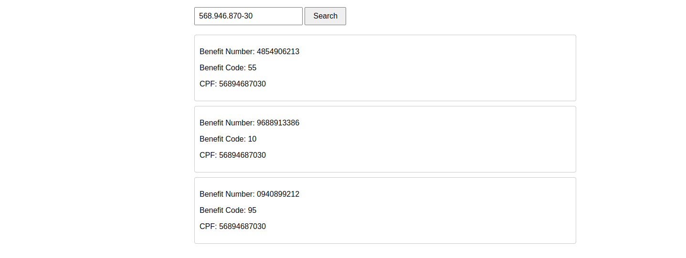

<p align="center">
    
</p>

# Konsi Challenge App

API feita para o challenge técnico da Konsi.

# Como executar o projeto

Como o ElasticSearch se tornou uma ferramenta proprietária eles impuseram algumas limitações para utilizar o software. Só é permitido executar
localmente para fins de teste ou aprendizado. Criei um script simples para subir toda a parte de infraestrutura via Docker.
Recomendo a execução em sistemas Linux derivados de Debian e com a versão LTS do Node instalada. Eu utilizei o Ubuntu 24.04 e recomendo Node **23.3.0**.

1. Baixe o projeto:

```bash
gh repo clone DanubioLima/konsi-challenge-api
```

2. Entre na pasta do projeto:

```bash
cd konsi-challenge-api
```

3. Instale as dependências:

```bash
npm install
```

ou

```bash
npm ci
```

4. Configure as variáveis de ambiente:

O arquivo `.env.development` já vem configurado com o que é preciso para executar o projeto com exceção das credenciais da API da Konsi. Por segurança não coloquei elas no repositório. 

```bash
KONSI_USERNAME=your-credentials
KONSI_PASSWORD=your-credentials
```


5. Dê permissão de execução ao arquivo de configuração da infra:

```bash
chmod +x ./config-infra.sh
```

6. Execute o script:

**Importante: Execute apenas uma vez ao baixar o projeto.**

```bash
./config-infra.sh
```

Esse primeiro passo é um pouco demorado pois o ElasticSearch roda os próprios containers com licença de teste. 
O script já executará automaticamente a API subindo o servidor na porta 3000.

Nesse ponto deve ser criado uma pasta `elastic-start-local` que a própria instalação do ElasticSearch cria. Recomendo não alterar nenhum arquivo lá.

Ao acessar `http://localhost:3000` você deve ver essa interface simples:


5. Para rodar os testes é só executar:

```bash
npm run test
```

6. Popular a fila do RabbitMQ:

Criei também um script simples que envia os CPFs de testes já duplicados para a fila do RabbitMQ. Pode executar quantas vezes quiser para testar os fluxos:

```bash
node publish-messages.js
```

Depois pode pesquisar por algum CPF na interface e as matrículas correspondentes serão listadas:

